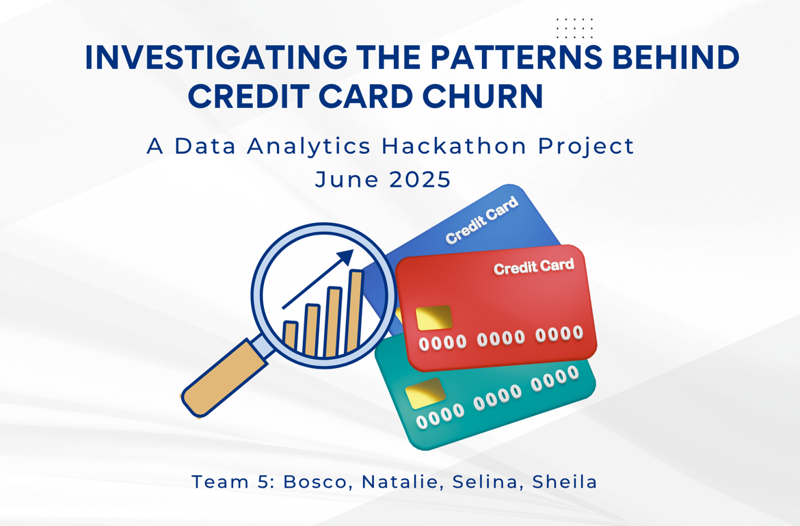
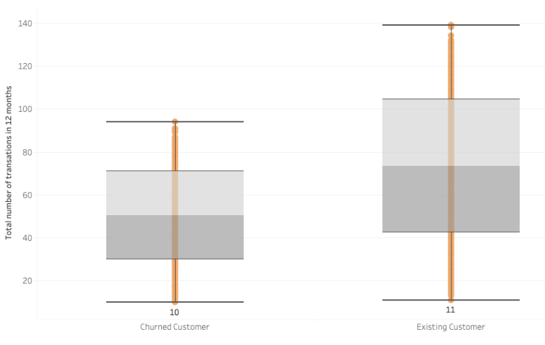
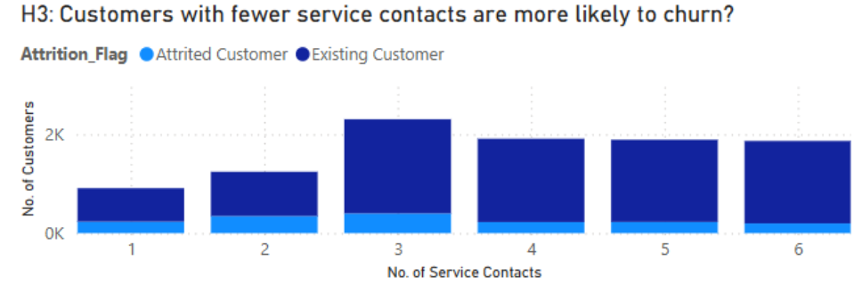
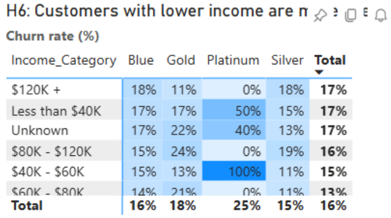
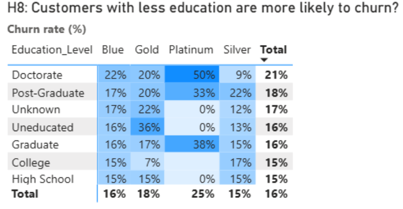
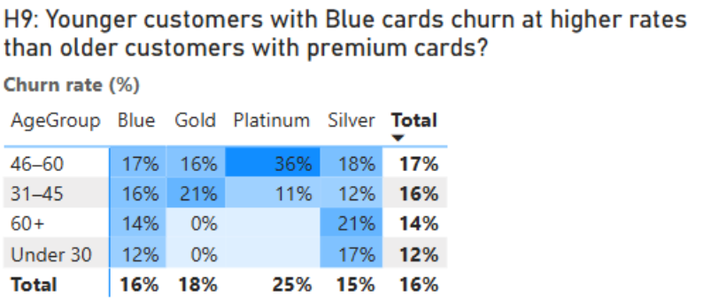
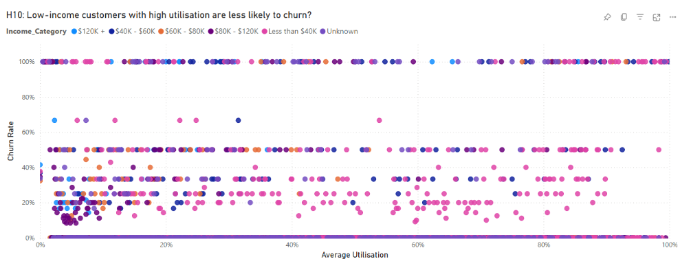
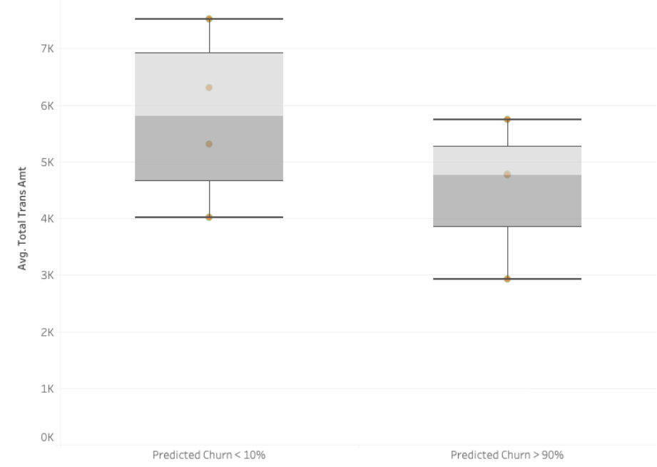
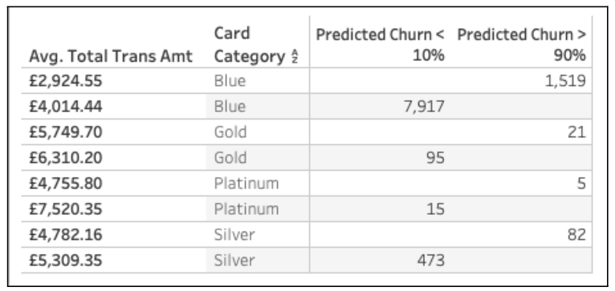

## 1. Problem Statement

Customer churn significantly affects profitability in the banking industry.  
This project aims to uncover behavioural, product, and demographic patterns that indicate a higher risk of attrition.  
By identifying these early warning signs, banks can design proactive strategies to retain valuable customers, particularly during critical lifecycle stages such as onboarding and product engagement.

---

## 2. Objectives

- Identify behavioural and product usage patterns linked to customer churn (H1–H5)
- Examine demographic and cross-segment traits that influence attrition risk (H6–H10)
- Examine predictive modelling to identify high-risk customers based on total transaction behaviour (H11)
- Test key hypotheses using structured customer profile and transaction data
- Visualise churn indicators and segments via BI dashboards
- Translate insights into actionable recommendations to reduce churn and improve retention

---

## 3. Dataset Content

**Data Source:** Kaggle - Credit Card Customers  
**Dataset:** `BankChurners.csv` (10,127 rows × 23 columns)

### Key Features

- **Demographics:** `Customer_Age`, `Gender`, `Marital_Status`, `Education_Level`, `Income_Category`, `Dependent_count`
- **Account Behaviour:** `Total_Trans_Ct`, `Total_Trans_Amt`, `Credit_Limit`, `Avg_Utilization_Ratio`, `Contacts_Count_12_mon`, `Months_on_book`
- **Product Info:** `Card_Category`, `Total_Relationship_Count`
- **Target Variable:** `Attrition_Flag` (Existing vs Attrited Customer)

> Note: `CLIENTNUM` and `Naive_Bayes_Classifier_*` columns are included. The dataset has no missing values and is suitable for churn modelling.

---

## 4. Business Requirements

This project supports stakeholder decision-making with clear, data-driven insights into the drivers of credit card churn.

### Key Business Goals

- Detect early churn signals from transactional activity, service interactions, card tier, and tenure (H1–H5)
- Uncover demographic and cross-segment risk factors to support targeted campaigns and offers (H6–H10)
- Leverage predictive modelling to identify high-risk customers based on total transaction behaviour (H11)
- Deliver interactive dashboards for stakeholder review and exploration of churn drivers
- Recommend strategic interventions to improve long-term customer value (CLV) across business functions

---

## 5. Hypotheses and Validation Framework

Eleven hypotheses were defined and explored using descriptive statistics, with visual analysis conducted in Power BI and Tableau.

### Core Hypotheses (H1–H5) – Behavioural & Product-based:

| Hypothesis | Business Question | Why it Matters |
|-----------|-------------------|----------------|
| **H1:** Customers with fewer transactions are more likely to churn | Are inactive cards early warning signs? | Helps flag low-engagement users for proactive retention |
| **H2:** Customers with lower credit utilization are more likely to churn | Are we missing out on future revenue from low-usage customers? | Suggests disengagement and underuse of credit services |
| **H3:** Customers with fewer service contacts are more likely to churn | Is silence a red flag? | Identifies customers who may be checked out |
| **H4:** Blue card holders are more likely to churn than premium card users | Are Blue cardholders disengaging earlier in the lifecycle? | Helps refine loyalty and upselling strategies |
| **H5:** Newer customers are more likely to churn | Are we losing customers right after onboarding? | Highlights importance of early engagement campaigns |

 
---

### Exploratory Hypotheses (H6–H10) – Demographic & Cross-Segment:

| Hypothesis | Business Question | Why it Matters |
|-----------|-------------------|----------------|
| **H6:** Lower income → Higher churn | Are some customers more likely to churn after 36 months? | Could guide targeted retention offers or pricing strategies |
| **H7:** Unmarried customers → Higher churn | Does life stage or stability influence churn behaviour? | Helps explore demographic-driven loyalty programs |
| **H8:** Less education → Higher churn | Are customers with lower financial literacy more likely to disengage? | May inform onboarding or communication tone |
| **H9:** Young Blue card users → Higher churn | Are young, low-tier customers the most at risk? | Cross-segmenting can reveal priority intervention groups |
| **H10:** Low-income + high utilisation → Lower churn | Are financially stretched but engaged users more loyal? | Helps refine credit risk strategy vs. churn risk |

 
---

### Core Hypothesis (H11) – Behavioural & Predictive:

| Hypothesis | Business Question | Why it Matters |
|-----------|-------------------|----------------|
| **H11:** Lower total transaction amount → Higher churn probability | Can low total spend predict future churn risk? | Helps identify high-risk customers using machine learning for proactive targeting |

---

## 6. ETL Process (Extract, Transform, Load)

### Extract:
- Data Source: Kaggle “BankChurners.csv”
- Format: CSV (10,127 records × 23 columns)
- Downloaded and stored in a GitHub repository

### Transform:
- Retained all columns
- Renamed `Naive_Bayes_*` fields
- Encoded `Attrition_Flag` (1 = Attrited, 0 = Existing)
- Created `Churn_Status` column
- Verified no missing or duplicate values
- Categorised variables into bins for visuals
- Created derived features:
  - `util_bin`: credit utilisation (Low/High)
  - `income_bin`: income levels
  - `risk_group`: income × utilisation
  - `transaction_bin`, `contact_bin`, `tenure_group`, `education_level`, `card_tier`, `married_flag`

➡️ [Dataset link](https://www.kaggle.com/datasets/sakshigoyal7/credit-card-customers/data)

### Load:
- Exported cleaned CSV for import into Power BI and Tableau
- Loaded with slicers and filters for interactive visualisation

 
---

## Explanation of Derived Variables

When analysing customer behaviour for hypothesis testing, we created new variables to help group and interpret the data more clearly. These variables are not part of the original dataset but were derived from it to support specific statistical comparisons. Below is a layman-friendly explanation of what each variable represents and why it was created.

| Variable | Explanation |
|---------|-------------|
| `util_bin` | Groups customers by credit usage to assess churn impact |
| `income_bin` | Groups by income to test churn risk by economic segment |
| `risk_group` | Cross-segment of income and utilisation |
| `contact_bin` | Groups customers by service contact frequency |
| `transaction_bin` | Groups by number of transactions |
| `education_level` | Converts education into numeric for statistical comparison |
| `churn_status` | Numeric encoding of churn (1 = churned, 0 = retained) |
| `card_tier` | Groups card types into Blue/Premium |
| `tenure_group` | Groups customers by months on book |
| `married_flag` | Indicates marital status for churn behaviour analysis |

 

### Descriptive Statistics table
This report includes standard descriptive statistics, skewness, and kurtosis for all numeric variables in the dataset. It helps us summarise and understand the basic features of our data. Instead of looking at hundreds or thousands of raw numbers, we use statistics to get a quick overview.

- Mean: It gives us a sense of central tendency.
- Median: It helps spot outliers if the mean and median are very different, which is the case with some variables
- Min/Max: It shows us the full range of data.
- Standard Deviation: It helps us understand variation or consistency in the data.
- Quartiles (25%- 50%- 75%): Split your data into four equal parts, like slicing a cake into four equal pieces. Quartiles help us understand the spread and where most values fall in the dataset.
- Skewness: It tells us if the data is symmetrical. This is important because if your data is skewed, it might affect decisions based on the mean (average). Sometimes, the mean does not reflect the reality of the dataset due to extreme values, and we might need to use different transformations to fix the issue.
- Kurtosis: It tells us about the "tailedness" or extreme outliers. It helps us spot the risk of rare, extreme events, which might be important for things like fraud detection, financial risk, or customer churn.

 
---

## 7. Project Plan

A structured data analysis workflow ensured traceability from business objectives to actionable insights.

### High-Level Steps:
1. Data Collection – Kaggle
2. Data Processing – Clean, transform, encode
3. EDA & Hypothesis Testing
4. Visualisation – Power BI & Tableau
5. Insights & Recommendations

 

### Tools:
- Python in VS Code (ETL and Feature Engineering)
- GitHub (Version Control)
- Power BI and Tableau (Interactive Visualisation)

 
---

## 8. Hypothesis Testing Summary and Statistical Validation

This report summarises the findings of 11 hypotheses tested using customer behavioural, demographic, and product usage data to understand the drivers of credit card churn. Each hypothesis is evaluated with its outcome, reasoning, and actionable recommendations.

 

### Hypothesis Validation Table:

| Hypothesis                                                                 | Supported?   | Reasoning                                                                                      | Recommendation                                                                                       |
|----------------------------------------------------------------------------|--------------|------------------------------------------------------------------------------------------------|------------------------------------------------------------------------------------------------------|
| H1: Customers with fewer transactions are more likely to churn            | Yes          | T-test showed a significant difference in transaction counts between churners and non-churners. | Flag low-activity users early and engage them with usage-based incentives or reminders.             |
| H2: Customers with lower credit utilisation are more likely to churn      | Yes          | T-test showed a significant difference: churners tend to have lower utilisation ratios (p < 0.05). | Monitor low-utilisation customers and create engagement campaigns to increase usage and stickiness. |
| H3: Customers with fewer service contacts are more likely to churn        | No           | T-test revealed no significant difference in service contact frequency.                        | Do not rely on contact frequency as a churn predictor; monitor other engagement signals.             |
| H4: Blue card holders churn more than premium users                       | No           | Chi-square test showed no significant association between card type and churn.                | Loyalty strategies should focus on factors beyond card tier alone.                                  |
| H5: Newer customers are more likely to churn                              | No           | T-test showed no significant difference in tenure between churners and non-churners (p > 0.05). | Avoid general assumptions based on tenure alone; look for behavioural signals instead during early stages. |
| H6: Lower income customers are more likely to churn                       | No           | Chi-square test p-value > 0.05; no strong evidence of income-level effect on churn.            | Avoid targeting retention strategies based solely on income level.                                  |
| H7: Unmarried customers are more likely to churn                          | Not conclusive | Chi-square test p-value > 0.05; no clear churn pattern by marital status.                      | Design retention offers based on behavioral data instead of demographics like marital status.       |
| H8: Less educated customers are more likely to churn                      | Yes          | Chi-square test showed a statistically significant relationship (p < 0.05).                     | Use clear and simplified communication for customers with lower education levels.                   |
| H9: Younger Blue card users churn more than older premium users           | Yes          | Chi-square test showed marginal significance (p ≈ 0.048).                                      | Target young, low-tier users with tailored perks to improve their retention.                        |
| H10: Low-income, high-utilisation customers are less likely to churn      | Yes          | Chi-square test is highly significant (p < 0.001), supporting this cross-segment hypothesis.    | Monitor and reward this group to boost satisfaction and retention while managing credit exposure effectively. |

 

| Hypothesis                                                                                                                        | Supported? | Reasoning                                                                                                                | Recommendation                                                                                                              |
|-----------------------------------------------------------------------------------------------------------------------------------|------------|--------------------------------------------------------------------------------------------------------------------------|-----------------------------------------------------------------------------------------------------------------------------|
| H11: A customer’s total transaction amount is a predictor of their likelihood to churn. Lower transaction amounts are directly correlated with a higher probability of churning. | Yes        | Used a machine learning model (Naive Bayes Classifier), that includes the total transaction amount as one of the input features. | The model predicted higher churn probabilities for customers with lower total transaction amounts. The table shows a lower value for churned customers. |

 
---

## 8.1 Hypothesis Testing with Statistical Evidence and Visual Insights

### H1: Customers with fewer transactions are more likely to churn

- **Validation Status:** Hypothesis Supported

- **Visual Analysis:** The whole population had between 10 and 139 transactions.The attrited population had a smaller range of transactions and was concentrated at the lower end, between 10 and 94.
This suggests that the hypothesis is true.
Further statistical tests to validate are performed (see Hypothesis Validation Table above).
Note: Hypotheses 2 to 5 were tested with the exclusion of customers who had more than 100 transactions, as there were no attrited customers in this range.

- **Statistical Analysis:**  
 A two-sample t-test compared the average number of transactions between churned and retained customers:
- Churned Mean ≈ 61.7
- Retained Mean ≈ 65.3
- t-statistic ≈ -7.06, p-value < 0.001

This statistically significant result supports the hypothesis. Lower transactional activity is strongly associated with churn, validating the visual observation.

- **Recommendation:** 
Implement proactive engagement strategies for customers with low transaction counts. This could include personalised nudges, transaction-based rewards, or usage reminders to drive reactivation. Since no churn occurred above 100 transactions, this threshold can be used as a protective benchmark in churn-risk modelling.

 

 

---

### H2: Customers with lower credit utilisation are more likely to churn

- **Validation Status:** Further analysis required (as inconsistency observed between the visual and statistical analysis)

- **Visual Analysis:** The majority of the customers, either attrited or existing, have zero average utilisation %.  It is envisaged that credit utilisation is not a main factor for customer churn.
Further statistical tests to validate are performed (see Hypothesis Validation Table above).

- **Statistical Insight:** A two-sample t-test was conducted to compare average credit utilisation between churned and retained groups:

  - Churned Mean ≈ 0.027  
  - Retained Mean ≈ 0.039  
  - t-statistic ≈ -3.80, p < 0.001

Despite the visual impression of flatness due to many zeroes, the statistical test indicates a significant difference.
Churned users, on average, used less credit than retained users, suggesting underutilisation is linked to disengagement.

- **Recommendation:**  
Incentivise credit activity among customers with zero or low utilisation.
Introduce usage-based rewards (e.g. cashback, tier upgrades) or targeted education on card benefits.
Use utilisation as a supporting feature in churn prediction models to detect subtle disengagement.

 

---

### H3: Customers with fewer service contacts are more likely to churn

- **Validation Status:** Hypothesis Not Supported

- **Visual Analysis:**  Although the number of attrited customers are a little bit higher where there were fewer contacts, the difference does not seem to be material in numbers, i.e. the light blue bars are fairly uniform across the plot.
However, 1 and 2 contacts are likely to stand out in percentage terms when analysed individually, and this can be further investigated.

- **Statistical Analysis:** A two-sample t-test compared the average number of service contacts between churned and retained customers:

  - Churned Mean ≈ 2.26  
  - Retained Mean ≈ 2.36  
  - t-statistic ≈ -1.47, p ≈ 0.14

  This result is not statistically significant, indicating that the number of service contacts does not differ meaningfully between churned and retained users.

- **Recommendation:**  
  While not statistically predictive, low-contact behaviour may still signal disengagement in some users.
 Consider using contact frequency as a supporting churn indicator when combined with other factors like low transactions or low utilisation.
 Introduce optional satisfaction check-ins for users with 1–2 contacts to capture silent dissatisfaction before churn occurs.
  

---

### H4: Blue card holders are more likely to churn than premium card users

- **Validation Status:** Hypothesis Not Supported

- **Visual Validation:**  The chart suggests that the majority of the attrited customers are Blue card holders.  However, the Blue card population far exceeds all the premium cards combined.
It may not be a meaningful comparison between the card categories for evaluating the hypothesis.

- **Statistical Insight:**
  - Chi-Square ≈ 26.88  
  - p < 0.001

 The result is statistically significant, indicating that churn behaviour does differ by card type.
 While the raw count is skewed due to population size, the proportion of churn within Blue card users is still elevated, supporting a potential risk factor when adjusted for volume.

- **Recommendation:**  
 Although not visually compelling, the statistical evidence suggests card tier is a relevant churn signal.
Consider reviewing Blue tier benefit structures to boost loyalty or create upgrade pathways with incentives. This group may need clearer value communication to reduce dropout.
 

---

### H5: Newer customers are more likely to churn

- **Validation Status:** Hypothesis Not Supported

- **Visual Analysis:**  It looks close to a normal distribution centering around the towering bar in month 36.  There is no linear relationship we can see between the number of months on book and number of churns, but rather a concentration of attrited and existing customers in month 36. 
 It is possibly related to a promotion and this can be further investigated.
 Churn rates were derived to support the assessment of H6–H9.
 
 The rates can be derived from:
 Number of attrited customers / Number of total customers
 for each of the segments that are of interest.

- **Statistical Insight:** A two-sample t-test compared the average tenure (months on book) between churned and retained customers:

  - Churned Mean ≈ 35.46 months  
  - Retained Mean ≈ 35.93 months  
  - t-statistic ≈ -1.39, p ≈ 0.16

  The difference was not statistically significant, confirming that tenure does not strongly predict churn in this dataset.

- **Recommendation:**  
 Despite no strong tenure-based churn trend, it's advisable to investigate lifecycle peaks, especially around month 36, for campaign or cohort effects (e.g. ending promotions or changes in service terms).
 Continue delivering onboarding support and engagement in the early months to ensure customers see value before potential drop-off points emerge.
 

---
 
### H6: Customers with lower income are more likely to churn

- **Validation Status:** Hypothesis Not Supported

- **Visual Analysis:** Churn rates across income categories are broadly similar, ranging from 13% to 17%, indicating no strong correlation between income level and churn.
Statistical testing confirmed that the observed differences were not significant, suggesting that income alone is not a reliable predictor of churn.
However, when the data is segmented further by card category, noticeable patterns emerge:

- Platinum card holders showed churn rates exceeding 40%, prompting deeper investigation.

- Interactive charts also revealed demographic patterns related to education, marital status, and age.
Given the small number of Platinum customers, there may be misclassification or user error in card selection, which warrants further investigation and analysis.

- **Statistical Insight:**
A Chi-Square test of independence was conducted to test the relationship between income level and churn:

  - Chi-Square ≈ 11.22  
  - p ≈ 0.0246

  Although the test result is statistically significant at the 5% level, the effect size is small, and the practical difference in churn rates between income groups is minimal.
Therefore, while a weak association exists, income is not a strong standalone predictor of churn.

- **Recommendation:**  
  Do not prioritise income alone in churn risk modelling. Instead, use income as a secondary segmentation factor in combination with card category and behavioural traits.
 The unusual churn rate among Platinum card holders with low representation suggests a data quality check is needed. Consider conducting a deeper segmentation analysis to detect meaningful risk patterns in small, high-churn subgroups.
 

---

 
### H7: Unmarried customers are more likely to churn

- **Validation Status:** Hypothesis Not Conclusive

- **Visual Analysis:**  Churn rates for married customers stood at 15%, and unmarried customers were not materially higher.

- **Statistical Insight:**
 A Chi-Square test of independence was conducted to assess the relationship between marital status and churn:

  - Chi-Square ≈ 3.66  
  - p ≈ 0.056

The result is marginally above the 0.05 threshold, meaning it is not statistically significant.
There is no strong evidence of a meaningful difference in churn between married and unmarried customers.

- **Recommendation:**  
Treat marital status as a weak or explanatory variable rather than a primary churn predictor.
You may still consider A/B testing lifestyle-aligned messaging (e.g. single vs. family-oriented) in marketing or communication campaigns, but it should not drive core retention strategy.
 

---

### H8: Customers with less education are more likely to churn

- **Validation Status:** Further analysis required (as inconsistency observed between the visual and statistical analysis)

- **Visual Analysis:**
Doctorate and post-graduate had higher churn rates than the rest, which does not support the hypothesis at the aggregated level.
However, drilling into the Gold card category alone reveals a different pattern:
Uneducated customers have the highest churn rate in the Gold card category.

- **Statistical Insight:**
 A Chi-Square test was conducted to evaluate the association between education level and churn:

  - Chi-Square ≈ 9.72  
  - p ≈ 0.045

 The result is statistically significant at the 5% level, suggesting a weak overall association.
 While the aggregate data doesn’t align with the hypothesis, segment-level analysis (e.g. Gold cardholders) reveals more actionable churn patterns.

- **Recommendation:**  
Use education level as a secondary churn indicator, especially in combination with card tier.
Tailor communication and onboarding for less-educated segments within specific products (e.g. Gold card) to clarify benefits and reduce confusion.  
Consider simplifying content or offering guided experiences for lower-education users in high-risk product tiers.
 

---
 
### H9: Younger customers with Blue cards churn at higher rates than older premium customers

- **Validation Status:** Further analysis required (as inconsistency observed between the visual and statistical analysis)

 **Visual Analysis :**
Churn rate for Under 30 with Blue card was 12%, whilst 60+ with Silver card was 21%, for example.
The hypothesis cannot be asserted outright.
 It can be seen that H6–H9 are very broad hypotheses, and further cross-segmentation analyses are required.
 Slicers were added to the interlinking charts to support the investigation.
 There are a few interesting initial observations, for example:
Age 60+, Doctorate, and Blue card holders with unknown income had a churn rate of 67% — but the population size was only 3 customers.

Divorced Blue card holders with unknown education level in the $120K+ income category had a churn rate of 33%, based on a population of 9.
 These observations, together with the high churn rates seen for the small Platinum card population, suggest that while cross-segmentation analysis gives greater insight, the reliability of results is limited by small sample sizes.

- **Statistical Insight:**
  A Chi-Square test was performed to assess the relationship between age, card tier, and churn:
  - Chi-Square ≈ 36.83  
  - p < 0.001

This is a highly significant result, confirming a strong association between age-card tier combinations and churn risk.
 Younger users with low-tier cards (like Blue) are statistically more likely to churn than older customers with premium cards.

- **Recommendation:**  
 Prioritise churn prevention for younger Blue cardholders, especially those in early relationship stages or with limited service usage.
 Offer onboarding journeys, lifestyle-aligned rewards, and early-stage education to increase loyalty.
 Continue refining churn models with cross-segmentation, but remain cautious of small sample artefacts when interpreting extreme rates in niche subgroups.
 

 

---
 
### H10: Low-income, high-utilisation customers are less likely to churn

- **Validation Status:** Further analysis required (as inconsistency observed between the visual and statistical analysis)

- **Visual Analysis:**
A scatter plot of churn rate vs. average utilisation, colour-coded by income category, revealed a distinct pattern:
The churn rates are widely distributed for the low-income and high utilisation segment. There is no visible pattern from the chart.

- **Statistical Analysis:**
A Chi-Square test was conducted on combined bins of income level and utilisation band (e.g. low-income/high-utilisation, high-income/low-utilisation, etc.).
The test returned the following results:

  - Chi-Square ≈ 151.55  
  - p < 0.001

  This confirms a highly statistically significant relationship between income-utilisation groups and churn status. We confidently reject the null hypothesis, concluding that churn behaviour varies significantly based on the combination of income and credit usage.

- **Recommendation:**  
Protect and reward this financially engaged segment with retention-focused strategies.
Introduce loyalty schemes, service stability guarantees, or early repayment rewards to reinforce their commitment.
Consider credit line reviews or responsible limit increases to support their needs while recognising their loyalty.
This group, though financially constrained, shows high product dependency — strengthening their trust can drive long-term retention and advocacy.
 

---
 

### H11: A customer's total transaction amount is a predictor of their likelihood to churn.

- **Validation Status:** Hypothesis Supported

- **Visual Analysis:**  
 A boxplot comparing Total Transaction Amount  across churned vs. existing customers clearly illustrates the pattern:

Churned customers have significantly lower median transaction amounts compared to existing customers.

The interquartile range for churned customers is also lower, suggesting lower overall spend and engagement across the group.

Supporting tables further show that the bottom quartile of transaction spend is disproportionately made up of churned accounts.

This implies that disengaged customers — indicated by fewer transactions — are more likely to churn.

- **Statistical Analysis:**  
 A statistical test was not performed. Instead, a machine learning classifier in the data set (Naive Bayes) was used which was supplied in the dataset. It assessed the probability chat customers would stay or churn based on transaction amount, service contacts, number of dependents, education level and number of months inactive.

The model returned higher churn probabilities for customers with lower transaction amounts.
Combined with the visual evidence, this supports the conclusion that lower spend correlates with higher churn risk.
While this does not provide a classical p-value, the consistent pattern across ML output and distribution analysis gives strong indicative support for the hypothesis.

- **Recommendation:**  
  - Flag low-spend customers early in their lifecycle for proactive engagement.
  - Introduce tailored offers or check-in campaigns to re-engage low-activity users.
  - Investigate whether low spend reflects lack of awareness, poor fit, or dissatisfaction.
  - Consider A/B testing retention nudges (e.g. bonus points, waived fees) based on transaction behavior thresholds.
  - Focusing on early intervention in these low-transaction cohorts may reduce churn and improve product adoption.
 

---

 

## 9. Dashboard Design

Dashboards were designed to help analyse relationships between the variables under each of the hypotheses.  The first dashboard focuses on the behavioural variables, enabling relationships across the related hypotheses to be observed.  Slicer was added for drilldown into different transaction count ranges, to help uncover unexpected patterns.
The second dashboard groups the hypotheses that are related to demographic variables.  Additional button slicers were created for ease of drilldown and cross segmentation analysis.  Churn rate was chosen for use as the measure of the hypothesis testings in this dashboard.  A population size check table was added to give some context in terms of data volume and therefore credibility of the churn rates observed.  A new column has also been added to support age grouping for the analysis.
The third dashboard supports the analysis of Hypothesis 10, providing the distribution of churn rates for different income and credit utilisation groups.
 

### Dashboard 1 – Hypotheses H1 to H5 

🔗 [Power BI Dashboard – H1 to H5](https://app.powerbi.com/groups/0341ada4-06e9-467c-8f5d-7254685bfc90/reports/f5bb43c9-7ffb-4968-94c6-99462dbc61ee/6997791f630daddfb918?experience=power-bi)

---

### Dashboard 2 – Hypotheses H6 to H9 (Demographic)

🔗 [Power BI Dashboard – H6 to H9](https://app.powerbi.com/groups/0341ada4-06e9-467c-8f5d-7254685bfc90/reports/f5bb43c9-7ffb-4968-94c6-99462dbc61ee/6e56bbfd4693fdc3e5f7?experience=power-bi)

---

### Dashboard 3 – Hypothesis H10 (Cross-Segment)

🔗 [Power BI Dashboard – H10](https://app.powerbi.com/groups/0341ada4-06e9-467c-8f5d-7254685bfc90/reports/f5bb43c9-7ffb-4968-94c6-99462dbc61ee/17a6d683d290d7887407?experience=power-bi)

---

### Tableau Dashboard – Hypotheses H1–H3 & H11

[View Dashboard on Tableau Public](https://public.tableau.com/app/profile/natalie.waugh/viz/CreditCardChurnHackathon/Sheet3)

---
 

## 10. Analysis Techniques

To investigate the behavioural, product, and demographic patterns behind customer churn, a combination of exploratory data analysis (EDA), segmentation, visual analytics, and statistical hypothesis testing was employed. The techniques were selected to uncover both high-level trends and granular insights that support data-driven decision-making. The following methods were applied:

### 1. Data Preparation and Cleaning

- Used Python (Pandas, NumPy, Matplotlib, scipy) for loading, inspecting, and cleaning raw customer data.
- Mapped ordinal categorical variables (e.g. income bands, education levels) to numeric formats to enable comparative analysis.
- Handled missing and ambiguous values appropriately (e.g. treating 'Unknown' as a distinct category for analysis).

### 2. Visual Analysis in Power BI and Tableau
- Developed interactive dashboards primarily using Power BI to explore churn patterns across  multiple dimensions.
- Used Tableau during the experimentation and exploratory analysis phase to prototype visualisations and test analytical angles before dashboard development.
- Applied slicers, filters  dynamically segment customers by attributes such as card type, income, education, and age.
- Created a range of visuals including:
-Bar charts and stacked visuals to analyse categorical churn distribution
- Boxplots for behavioural comparisons (e.g. credit utilisation, contact frequency)
- Scatter plots to identify cross-variable patterns (e.g. income × utilisation × churn)
- Descriptive tables

### 3. Hypothesis Testing
Formulated and tested 11 business hypotheses (H1–H11) to validate assumptions about churn risk drivers.
Used two-sample t-tests to compare means between churned and retained groups for continuous variables including:

  - Transactions (H1)
  - Utilisation (H2)
  - Tenure (H5)
  - Service contacts (H3)

  - **Chi-Square tests** 
 Applied Chi-Square tests of independence for categorical variables to assess churn behaviour across:
  - Income brackets (H6)
  - Card tiers (H4)
  - Marital status, education, and age groups (H7–H9)
  - Combined income and utilisation segments (H10)
  - The churn probability for (H11) was generated using a statistical method provided to us in the dataset

### 4. Segmentation

- Conducted cross-segmentation analysis to identify churn risks within niche customer subgroups (e.g. younger Blue cardholders, low-income high-utilisers).

- Leveraged slicers and multi-level filters in Power BI to drill into high-risk combinations and interactively explore relationships.

- Noted and addressed limitations arising from small population sizes in certain subsegments (e.g. Platinum customers).

### 5. Validation and Synthesis

- Triangulated visual patterns with statistical findings to confirm or reject hypotheses.

- Used statistical significance to validate key drivers while relying on visual cues for exploratory insights.

- Synthesised insights into a set of recommendations for improving retention through segment-specific strategies.
 
---

## 11. Unfixed Bugs

- Not applicable. No unresolved bugs were encountered during this project.

---

## 12. Development Roadmap

### Challenges Faced and Strategies Used

#### Time Constraints  

**Challenge:** The project was completed under significant time pressure — just three days with a team of four members.  

**Strategy:** We invested time early in project planning, setting up a Kanban board and assigning roles in advance. We conducted test runs using VS Code and GitHub to practice collaboration, branch management, and conflict resolution. This preparation paid off — the actual project ran smoothly with minimal issues.

#### Data Quality and Interpretation  

**Challenge:** Several fields included “Unknown” values (e.g. income, education), and some segments (like Platinum cardholders) had very small populations, making the results hard to interpret reliably.  

**Strategy:** We treated “Unknown” as its own valid category rather than discarding data. We also carefully flagged low-population segments to avoid over-interpreting small-group churn patterns.

#### Visual vs. Statistical Signals  

**Challenge:** In some hypotheses (e.g. H2), visual patterns were flat, yet statistical testing showed significance.  

**Strategy:** We consistently applied t-tests and Chi-Square tests alongside Power BI visuals to ensure all insights were backed by data, not just charts.

#### Cross-Segment Complexity  

**Challenge:** Some churn patterns only emerged when segmenting across multiple attributes (e.g. age × card type × income), which increased complexity and risk of false insights.  

**Strategy:** We used Power BI slicers and filters to test combinations interactively, and noted where segment sizes were too small for reliable conclusions.

#### Technical and Personal Constraints  

**Challenge:** Team members encountered various external challenges, including technical issues (e.g. internet connectivity and laptop configuration), language barriers, and family responsibilities (e.g. childcare and exams).  

**Strategy:** We adapted by keeping communication concise and asynchronous when needed, supporting each other with flexible task handovers. We also used clear documentation and maintained focus on individual contributions to keep momentum despite differing schedules and constraints.
 

### Next Steps and Skills to Develop

#### Predictive Analytics and Modelling  
- Explore how to build churn prediction models using logistic regression or classification algorithms.  
- Learn how to evaluate feature importance to rank which customer behaviours or traits most influence churn.

#### Advanced Visualisation Techniques  
- Develop more advanced skills in Power BI, including custom visuals, DAX measures, and drill-through reports.  
- Continue using Tableau for rapid experimentation and interactive storytelling.

#### Statistical Thinking  
- Strengthen our ability to interpret and explain statistical test results, p-values, and assumptions behind each test.  
- Apply this to support evidence-based decision-making in future analytical projects.
 
---

## 13. Findings and Recommendations

### **Issue 1: Dataset Sample Size is Small **
- Certain customer segments, such as Platinum cardholders, show significantly higher churn rates.  
- However, the sample size in these segments is too small to support statistically reliable conclusions.  
- Many customers have low or no card utilisation, which correlates with higher churn.  
- **Business Impact**: Missed revenue opportunities due to disengaged customers and unreliable segment insights.

---

### **Issue 2: Low Spending Is Linked to High Predicted Churn**

- The box plot shows that customers with predicted churn >90% had significantly lower average total transaction amounts compared to those with churn <10%.  
- Low-churn customers average £5K–£7K in total spend, while high-churn cohorts spend around £3K–£5.5K.  
- Blue cardholders represent the largest high-churn group (1,519 customers), with the lowest average spend at £2,924.55.  
- Higher-spending cardholders (Gold and Platinum) are more concentrated in the low-churn group.  
- **Business Insight**: Low spending is a strong early indicator of disengagement and future churn, especially among mass-market Blue cardholders.

---

## Recommendations: 

**How might we increase customer spending and deepen engagement across card segments?**

To reduce churn and improve revenue, we recommend a targeted engagement strategy aimed at increasing card activity, particularly among low-spending cohorts:

- **Customer Insight Research**  
  - Conduct focus groups and surveys to understand barriers to spending, feature confusion, or perceived lack of value.

- **A/B Testing for Behavioural Nudges**  
  - Test personalised incentives (e.g. fee waivers, bonus points, usage reminders) to identify what drives meaningful card usage.

- **Onboarding and Retention Campaigns**  
  - For new customers: Launch welcome packages including exclusive events, limited-time offers, or discount coupons to promote early card use.

- **Gamified Loyalty Programme**  
  - Develop a mobile loyalty app to reward usage through tiers, challenges, and personalised goals.  
  - Use gamification to turn spending into a rewarding, engaging experience and increase customer lifetime value (CLV).

 
---

## 14. Ethical Considerations

- Dataset contains no personally identifiable information (PII)
- All fields are anonymised or aggregated (e.g. income bands, education level)
- No legal or ethical risks encountered — the dataset is open source and for educational purposes
 
---

## 15. Deployment

- The project was not deployed as a web application.
- All dashboards (Power BI, Tableau) and Jupyter Notebook files are available in the GitHub repository.
 
---

## 16. Main Data Analysis Libraries

Data cleaning and analysis were performed in Jupyter Notebook using Python, followed by dashboarding in Power BI and Tableau.

### Python Libraries & Tools Used:

- **pandas** – Data wrangling, e.g. dropping columns, inspecting nulls  
  Example: `df.drop(columns=['CLIENTNUM'])`

- **numpy** – Numerical operations and array handling  
  Example: `np.where(df['Attrition_Flag'] == 'Attrited Customer', 1, 0)`

- **scipy** – Statistical testing (t-tests, chi-square)

- **matplotlib** – Preliminary bar and histogram visualisation

- **VS Code** – IDE used for writing Python scripts and Jupyter notebooks

### Visualisation Tools:

- **Power BI** – Final dashboard creation, filtering, slicers, and chart development
- **Tableau** – Used for rapid prototyping and testing visual angles

### Version control was handled using: **GitHub**
 
---

## 17. Reflections

This project was a collaborative effort by a team of four, completed within three days.

- Each member contributed across data analysis, visualisation, modelling, and documentation.
- Initial challenges around alignment were overcome through structured planning, open communication, and shared goals.
- Key takeaways included:
  - The power of early role clarity
  - Flexibility and mutual respect under time pressure
  - Application of technical skills in a real-world analytics context
  - The project fostered growth in not only data analytics, but also teamwork, decision-making, and time management.
 
---

## 18. Credits

- **Dataset:** [Kaggle – Credit Card Customers](https://www.kaggle.com/datasets/sakshigoyal7/credit-card-customers)
- **Python Libraries:** pandas, numpy, scipy, matplotlib
- **Visualisation Tools:** Power BI, Tableau
- **Learning Resources:**
  - Code Institute LMS modules on Power BI and Tableau
  - [Markdown Guide](https://www.markdownguide.org/cheat-sheet/)
  - [W3Schools](https://www.w3schools.com/)
  - [YouTube – Alex The Analyst (Power BI in 3 Hours)](https://www.youtube.com/watch?v=I0vQ_VLZTWg)
  - ChatGPT & GitHub Copilot for guidance and optimisation
- **Team Support:** Tutors and peers
 
---

## 19. Acknowledgements

Special thanks to:
- Our tutors **Mark Briscoe** and **Spencer Barriball**
- Our Code Institute cohort teammates
- Everyone who contributed advice, testing help, and learning resources

